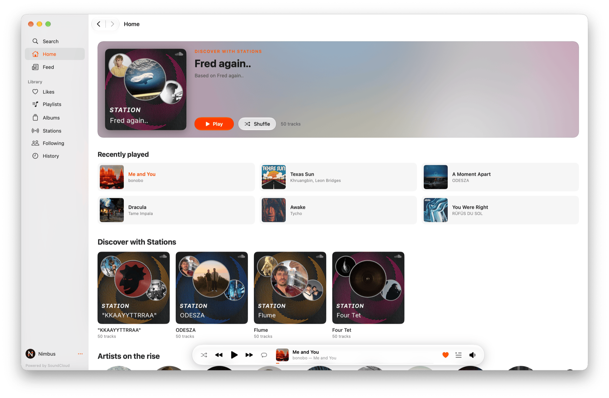
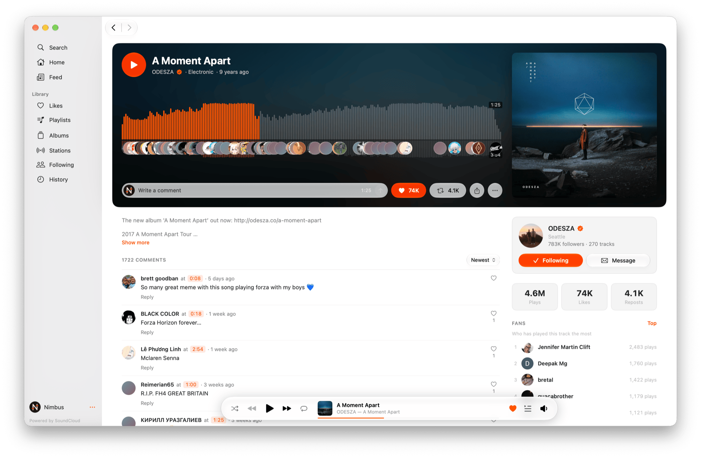
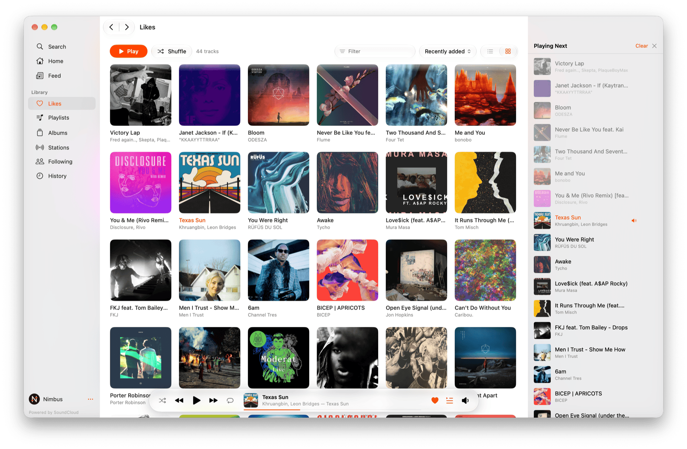
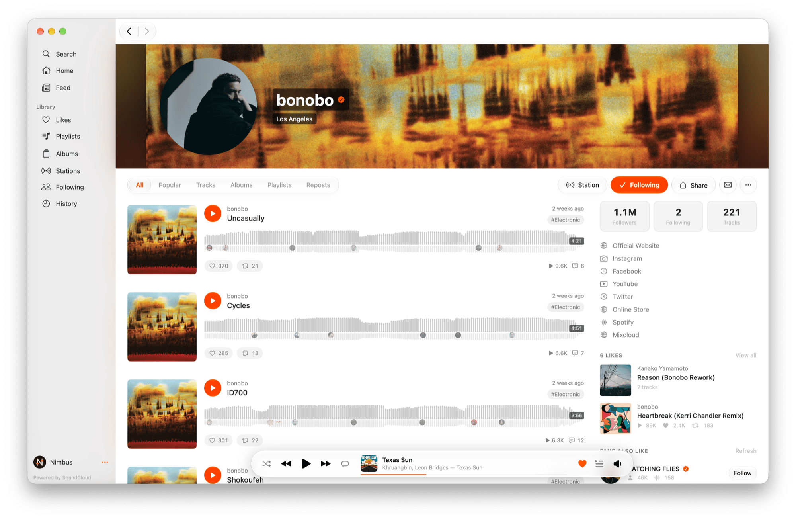

# Nimbus

A native SoundCloud client for macOS — built in SwiftUI, shaped like a Mac app rather than a web
page in a window.

<picture>
  <source media="(prefers-color-scheme: dark)" srcset="assets/home-dark.png">
  <source media="(prefers-color-scheme: light)" srcset="assets/home-light.png">
  
</picture>

## What it does

- **Plays without the gap.** Two decks with the next track warmed up ahead of time, so a change of
  track lands in tens of milliseconds instead of a second and a half.
- **A queue you can rearrange**, with drag and drop, and a player that stays out of the way.
- **The waveform, with its comments** — faces sit on the second they were written at, the way the
  site draws them.
- **Comments, likes, reposts and follows** — reading and writing, not a read-only viewer. What you
  play lands in your SoundCloud history, as it does from the website.
- **Moves like a Mac app.** Back and forward with a swipe, the way Finder does; lists that stay
  smooth however far you scroll and load more before you reach the end; menus laid out as Music's,
  with the shortcuts to match.
- **Stays current and picks up where you left off.** Feeds, likes and history refresh on their
  own; the queue, the track and the page you were on come back after a restart.
- **Instant search** across everything you have already browsed, while SoundCloud's own results
  load in.
- **Now Playing and the media keys**, because it is a Mac app.

Go+ and region-locked tracks are marked and skipped, as they are on the site.

<picture>
  <source media="(prefers-color-scheme: dark)" srcset="assets/track-dark.png">
  <source media="(prefers-color-scheme: light)" srcset="assets/track-light.png">
  
</picture>

<picture>
  <source media="(prefers-color-scheme: dark)" srcset="assets/likes-dark.png">
  <source media="(prefers-color-scheme: light)" srcset="assets/likes-light.png">
  
</picture>

<picture>
  <source media="(prefers-color-scheme: dark)" srcset="assets/artist-dark.png">
  <source media="(prefers-color-scheme: light)" srcset="assets/artist-light.png">
  
</picture>

## Keyboard

| | |
|---|---|
| Play / Pause | Space |
| Next / Previous | ⌘→ / ⌘← |
| Volume | ⌘↑ / ⌘↓ |
| Go to Current Track | ⌘L |
| Show Queue | ⌥⌘U |
| Back / Forward | ⌘[ / ⌘] |
| Find | ⌘F |
| Refresh | ⌘R |
| Shuffle | ⇧⌘S |

## Requirements

**macOS 26.0 or later, on Apple Silicon.** The interface is built on Liquid Glass, which arrived in
macOS 26; there is no fallback for earlier versions, and no Intel build.

## Installing

Download `Nimbus-<version>.dmg` from [Releases](https://github.com/Dearonski/Nimbus/releases) and
drag Nimbus into Applications.

The build is signed, but not notarised by Apple, so the first launch needs one extra step:

1. Open Nimbus. macOS says it cannot check it for malicious software — click **Done**.
2. Go to **System Settings → Privacy & Security**, scroll down and click **Open Anyway** next to
   Nimbus, then confirm.

After that it opens like any other app, updates included. Sign in happens in a web view, the same
as on soundcloud.com.

### Building from source

```
git clone https://github.com/Dearonski/Nimbus.git
cd Nimbus
open Nimbus.xcodeproj
```

Run the `Nimbus` scheme with your own Apple developer account (a free one is enough) selected in
the target's Signing & Capabilities. `tools/release.sh` builds the DMG.

## Reporting a problem

`Help → Report an Issue…` inside the app fills in the version, the system and a slice of the log
for you.

## Not affiliated with SoundCloud

Nimbus is an unofficial client, not connected with SoundCloud in any way. It talks to the same
internal API the website uses, with your own session, and it is meant for personal use. SoundCloud's
Terms of Service apply to you as a listener exactly as they do in the browser.

Powered by SoundCloud.

## Thanks

- [nuage-macos](https://github.com/lbrndnr/nuage-macos) — a SwiftUI SoundCloud client whose reading
  of the internal API saved a great deal of guessing.
- [yt-dlp](https://github.com/yt-dlp/yt-dlp) — where the approach to SoundCloud's rotating
  `client_id` comes from.

## License

MIT — see [LICENSE](LICENSE).
